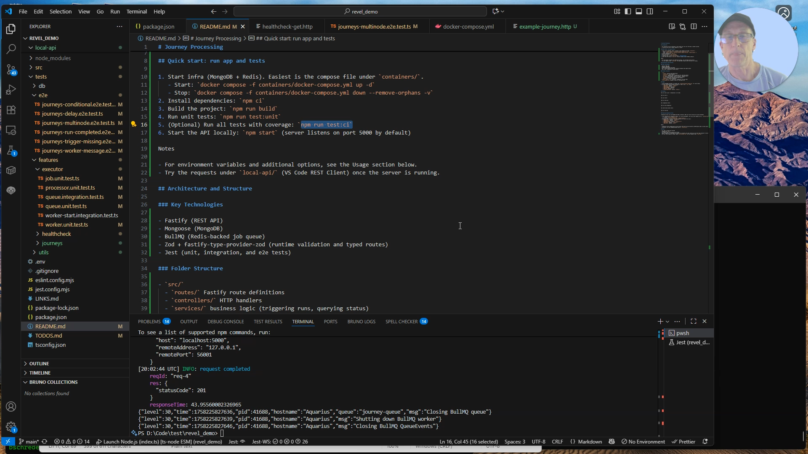

# Journey Processing

## Assumptions:

- All journeys are self contained => one journey will not call the node in another journey
- A journey starts when trigger endpoint is called
- A DelayNode's delay occurs before the nodes execution

## Demo Video

[](docs/Demo_Journey.mp4)

## Quick start: run app and tests

1. Start infra (MongoDB + Redis). Easiest is the compose file under `containers/`.
   - Start: `docker compose -f containers/docker-compose.yml up -d`
   - Stop: `docker compose -f containers/docker-compose.yml down --remove-orphans -v`
2. Install dependencies: `npm ci`
3. Build the project: `npm run build`
4. Run unit tests: `npm run test:unit`
5. (Optional) Run all tests with coverage: `npm run test:ci`
6. Start the API locally: `npm start` (server listens on port 5000 by default)

Notes

- For environment variables and additional options, see the Usage section below.
- Try the requests under `local-api/` (VS Code REST Client) once the server is running.

## Architecture and Structure

### Key Technologies

- Fastify (REST API)
- Mongoose (MongoDB)
- BullMQ (Redis-backed job queue)
- Zod + fastify-type-provider-zod (runtime validation and typed routes)
- Jest (unit, integration, and e2e tests)

### Folder Structure

- `src/`
  - `routes/` Fastify route definitions
  - `controllers/` HTTP handlers
  - `services/` business logic (triggering runs, querying status)
  - `executor/` BullMQ queue, worker, processor, and job helpers
  - `db/` Mongoose connection and query helpers, schemas
  - `models/` TypeScript interfaces and Zod schemas
  - `middleware/` Fastify middleware
- `tests/` mirrors `src/` with unit, integration, and e2e specs
- `docs/openapi.json` OpenAPI v3 spec for the public API

## Usage

1. Ensure MongoDb and Redis is running (see `containers/docker-compose.yml` for local setup).
2. Set the following environment variables (or add to your `.env` file):
   - `REDIS_HOST` (default: `localhost`)
   - `REDIS_PORT` (default: `6379`)
   - `REDIS_USERNAME` (optional)
   - `REDIS_PASSWORD` (optional)
   - `REDIS_DB` (default: `0`)
   - `BULLMQ_QUEUE_NAME` (default: `default`)

## Testing

Run all tests (unit + integration) in CI mode:

```
npm run test:ci
```

Run unit tests:

```
npm run test:unit
```

Run integration tests:

```
npm run test:integration
```

Run end-to-end journey tests:

```
npm run test:e2e
```

### Running Integration Tests

Integration tests use real MongoDB and Redis instances. Make sure local services are up and reachable.

1. Start dependencies (MongoDB and Redis). For local development, you can use the compose file in `containers/docker-compose.yml`.
   1. to start: `docker compose up -d`
   2. to shutdown: `docker compose down --remove-orphans -v`
2. Optionally set environment variables (defaults are used if not set):
   - `MONGODB_HOST` (default: `localhost`)
   - `MONGODB_PORT` (default: `27017`)
   - `MONGODB_DATABASE` (default: `revelai-test`)
   - `REDIS_HOST` (default: `localhost`)
   - `REDIS_PORT` (default: `6379`)

Notes:

- Integration tests automatically use per-worker HTTP ports and test-specific BullMQ queue names to avoid conflicts.
- By default, the test MongoDB database name is `revelai-test`.

## Notes

- All code is TypeScript and ESM.
- Logging uses `pino`.
- All public APIs are documented with JSDoc.
- Input validation: All payloads and params are validated with Zod; Fastify uses the Zod type provider for end-to-end typing.
- API docs: When endpoints change, update `docs/openapi.json` and the examples under `local-api/`.
